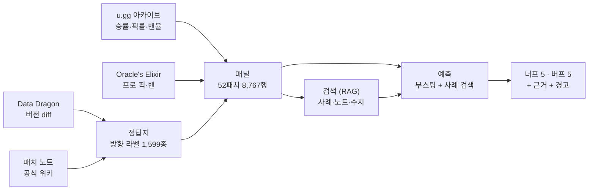

# 리그 오브 레전드 밸런스 조정 보조 도구

[](https://github.com/SangMyeong5426/LOL_BALANCE_PROJECT/actions/workflows/ci.yml)


리그 오브 레전드는 챔피언 173종의 강약을 2주마다 조정한다(**너프**=약화 · **버프**=강화).
다음 패치에 **누가 조정될지**를 공개 데이터로 예측하고, **왜 그런지**와 **무엇을 주의할지**를
붙여 내놓는다. 조정 여부를 정하는 것은 사람이다.

| | |
| --- | --- |
| **데이터** | 52패치 8,767행 · 솔랭 승률·픽률·밴율 + 프로 경기 픽·밴 29,977경기 |
| **누구를 볼까** | 173종 → 너프 5 · 버프 5. **무작위의 6.2배** |
| **어느 쪽일까** | **AUC 0.900 · F1 0.809 · MCC 0.617** |
| **무엇을 조심할까** | 프로 단골 버프 시 대회 출전 **+37%**, 그 외 ±0% |

## 무엇을 내놓는가

```text
$ ./scripts/predict --score

16_13 지표로 16_14 패치를 예측한다
  학습 8,594행 (~16_12) · 대상 173종

=== 너프 후보 상위 5 ===
   1 Senna         점수 0.91   ✅ 실제 너프
      ├ 밴율 23.7% — 173종 중 4위
      ├ 승률 52.6% — 173종 중 1위
      ├ 걸린 규칙 A-ban · A-popular · D-ban · D-strong
      └ 닮은 사례 25종 — 너프 24 · 버프 1
   ...

=== 버프 후보 상위 5 ===
   1 Azir          점수 0.72
      ├ 승률 46.6% — 173종 중 172위
      ├ 프로 픽·밴율 2.7% — 173종 중 87위
      └ ⚠ 프로 단골이다(평생 픽·밴율 41.7%). 승률이 낮아도 올려 주면
          대회 출전이 크게 뛴다 — 버프 주의
```

**Azir 이 이 도구의 요점이다.** 승률 173종 중 172위라 지표만 보면 무조건 버프인데,
올려 주면 대회가 터진다. **순위보다 이런 경고가 값이 있다.**

## 어떻게 도는가



**실행 시점에 LLM API 를 한 번도 부르지 않는다.** 모델이 만든 산출물(라벨 1,599종 ·
규칙 12개 · 판단 314건)은 저장소에 텍스트로 두고 코드가 읽어 채점한다
([ADR 0003](docs/adr/0003-llm-provider-and-calling-convention.md)).

## 결과

시간순 분할(`15_13` 앞뒤) 백테스트. 무작위 분할은 안 쓴다 — 자르면 미래가 과거로 샌다.

| 과제 | 최고 성적 | 기준선 | 배수 |
| --- | ---: | ---: | ---: |
| ① 누가 조정되나 | R-정확도 27.4% | 15.0% | 1.8배 |
| ①′ 누가 너프되나 | R-정확도 22.9% | 3.4% | **6.7배** |
| ② 너프인가 버프인가 | **AUC 0.900** | 0.796 | — |
| ③ 조정이 먹혔나 | 너프 79.5% · 버프 73.4% | — | — |
| ③′ 균형에 가까워졌나 | 너프 53.3% · 버프 63.1% | 50.5% | — |

> 누구를 건드릴지는 공개 지표로 잘 안 갈린다. **어느 쪽으로 건드릴지는 잘 갈린다.**

**LLM 이 통계를 이겼는지도 쟀고, 못 이겼다.** 대화로 뽑은 규칙(AUC 0.837)은 로지스틱
회귀와 동률이고, 검색 위에 올린 판단(0.830)은 다수결(0.850)을 못 넘었다.

전체 비교표 37개 arm · 지표 전량(PR-AUC · MCC · Brier · κ) · 검증 내역은
[`docs/results/README.md`](docs/results/README.md)에 있다.

## 시작하기

```bash
python3.11 -m venv .venv && source .venv/bin/activate
pip install -r requirements-dev.txt
./scripts/check-all                 # 테스트 332개 · 검사 11개
```

**API 키는 하나도 필요 없다.** 원자료는 커밋하지 않으므로 clone 직후 `data/` 는 비어
있고, 데이터가 필요한 검사는 건너뛴 것으로 적고 실패로 세지 않는다.

```bash
./scripts/fetch-ddragon && ./scripts/fetch-ugg && ./scripts/build-panel
./scripts/predict --score           # 너프·버프 후보 5종씩, 채점까지
./scripts/ask Senna 16_13           # 검색기 셋이 무엇을 찾아왔는지 본다
```

`ask` 는 `--answer` 없이는 실제 결과를 안 찍는다. **먼저 읽고 스스로 판단한 뒤 맞춰
보라는 것**이고, 검색 경계는 `as_of` 로 도구가 지켜 물어본 패치 이후 정보는 풀에 없다.

## 구조

```text
src/lol_balance/   수집 · 파싱 · 패널 · 예측 · 평가
scripts/           실행 진입점 (수집 · 라벨링 · 예측 · 리포트 · 검증)
ground_truth/      정답지 — 방향 라벨 1,599종 (커밋한다)
rules/             밸런스 규칙 12개 (커밋한다)
tests/             332개 · 커버리지 94%
data/ · runs/      원자료와 산출물 (커밋하지 않는다)
```

| | |
| --- | --- |
| 통계·ML | numpy · scikit-learn (부스팅 · 로지스틱 회귀 · k-NN) |
| 검색 (RAG) | BM25 노트 검색 · 수치 k-NN 사례 검색 · 수치 조회 |
| LLM | 라벨·규칙·판단을 대화로 만들고 텍스트로 저장. 실행 시 호출 0회 |
| 품질 | pytest · ruff · mypy · pre-commit · GitHub Actions |

**벡터 DB 를 안 쓴다** — 검색 둘 다 이미 벡터 공간 모델이고, 문서 3,843개 전수 스캔이
0.06 ms 라 넣을 이득이 없다. 밀집 임베딩도 재 봤는데 희소를 못 이겼다.

## 증명하지 않는 것

- 우리가 개발사보다 밸런스를 잘 잡는다 — 판단을 **예측**하는 것이지 평가가 아니다
- 예측이 정확하다 — 정확도는 **측정 대상**이지 전제가 아니다
- 개발사의 내부 프로세스가 이렇다 — 관측된 패턴일 뿐이다
- 이 도구로 밸런스를 대신 잡을 수 있다 — **판단 보조다**

## 여기까지 하고, 다음은 에이전트

**검색(RAG)까지 만들고 마무리했다.** 조회 → 검색 → 판단을 도는 에이전트는 다음 단계다.
검색기 셋([`retrieval.py`](src/lol_balance/retrieval.py))이 완성돼 있고 `as_of` 로 미래도
막혀 있어, **루프가 생기면 그대로 쓰인다.**

## 문서

| | |
| --- | --- |
| [`docs/results/`](docs/results/README.md) | 측정 결과 전량 · 실패한 시도 · 천장 |
| [`docs/lessons.md`](docs/lessons.md) | **막혔던 것들** — 조용히 틀리고 있던 것 넷을 무엇이 잡아냈나 |
| [`docs/spec/`](docs/spec/data-sources.md) | 데이터를 어디서 어떤 형식으로 받는가 |
| [`docs/adr/`](docs/adr/README.md) | 기술 결정 기록 8건 |
| [`docs/glossary.md`](docs/glossary.md) | 용어 — 여기 있는 말만 쓴다 |
| [`AGENTS.md`](AGENTS.md) | 작업 규칙 ([`CLAUDE.md`](CLAUDE.md)와 같은 문서) |
