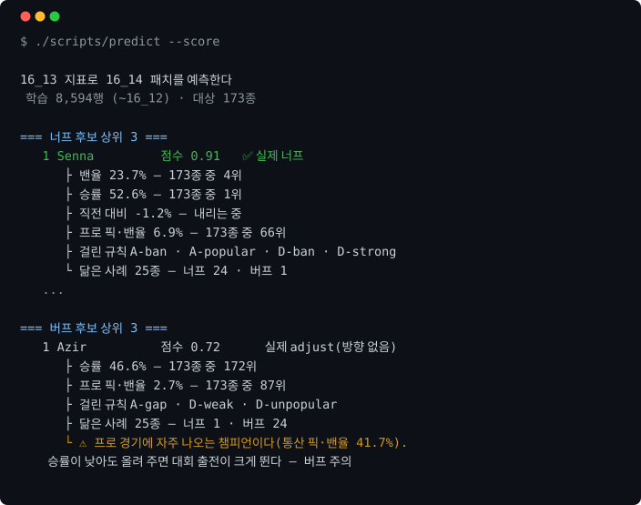
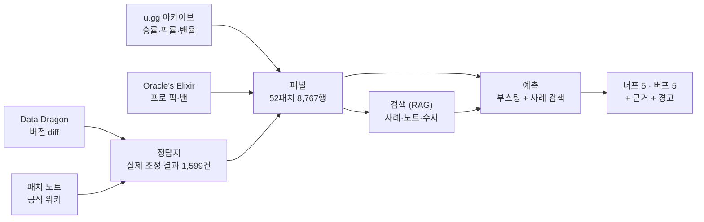
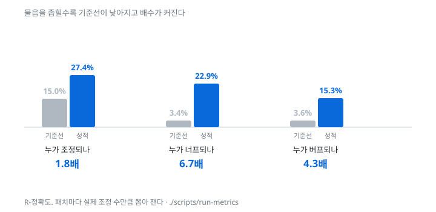

# 리그 오브 레전드 밸런스 조정 보조 도구

[](https://github.com/SangMyeong5426/LOL_BALANCE_PROJECT/actions/workflows/ci.yml)


리그 오브 레전드는 챔피언 173종의 강약을 2주마다 조정한다(너프는 약화, 버프는 강화).
이 도구는 다음 패치에 어느 챔피언이 조정될지를 공개 데이터로 예측하고, 그 근거와
주의할 점을 함께 제시한다. 조정 여부의 최종 판단은 사람이 한다.



**[브라우저에서 돌려 보기 →](https://sangmyeong5426.github.io/LOL_BALANCE_PROJECT/)**
패치를 고르고 후보를 읽은 뒤, 실제 결과를 켜서 맞춰 볼 수 있다.

Azir 의 사례가 이 도구의 목적을 보여 준다. 승률이 173종 중 172위이므로 지표만 보면
명백한 버프 대상이지만, 프로 경기에 자주 나오는 챔피언이라 버프할 경우 대회에서의
비중이 크게 오른다. 순위만으로는 이 판단을 할 수 없다.

너프 후보 다섯 중 하나가 실제로 너프된다. 무작위로 다섯을 고르면 여섯 번에 한 번꼴로
하나 맞는다. 통계·규칙·검색(RAG)·검색 위의 판단을 같은 분할과 같은 표본에서 겨루게 해
어느 갈래가 이기는지 측정한 것이 이 저장소의 답이다.

## 어떻게 도는가




정답지는 채점의 기준이다. 패치마다 어느 챔피언이 실제로 어느 방향으로 조정됐는지를
Data Dragon 버전 diff 와 공식 패치 노트로 만들어 두었다. 이것이 없으면 아래의 성적을
측정할 수 없다.

실행 시점에는 LLM API 를 호출하지 않는다. 모델이 만든 산출물(라벨 1,599종, 규칙
12개, 판단 314건)은 저장소에 텍스트로 두고 코드가 읽어 채점한다
([ADR 0003](docs/adr/0003-llm-provider-and-calling-convention.md)).

## 결과

시간순 분할(`15_13` 앞뒤) 백테스트다. 무작위 분할은 쓰지 않는다. 그렇게 자르면 미래
정보가 과거로 누출되기 때문이다.

| 과제 | 최고 성적 | 기준선 | 배수 |
| --- | ---: | ---: | ---: |
| ① 누가 조정되나 | R-정확도 27.4% | 15.0% | 1.8배 |
| ①′ 누가 너프되나 | R-정확도 22.9% | 3.4% | **6.7배** |
| ② 너프인가 버프인가 | AUC **0.900** | 0.796 | — |
| ③ 효과, 의도대로 갔나 | 너프 79.5% · 버프 73.4% | — | — |
| ③′ 효과, 균형에 가까워졌나 | 너프 53.3% · 버프 63.1% | 50.5% | — |



> 누구를 조정할지는 공개 지표로 잘 구분되지 않는다. 어느 쪽으로 조정할지는 잘 구분된다.

앞의 절반에는 이유가 하나 있다. 개발사는 공개한 기준에서 **모집단 넷**을 따로 보고
「어느 하나에서라도 넘으면 세다」로 판정하는데, 공개 데이터로 잡히는 것은 둘이다
([근거](docs/results/README.md#모집단-넷-중-둘만-본다)).

순위와 별개로, 앞의 Azir 경고를 뒷받침하는 측정이 따로 있다. 버프 299건을 두 집단으로
나누어 조정 뒤의 변화를 쟀다.


솔랭 승률은 양쪽이 거의 같게 오른다(+0.73%p 와 +0.75%p). 프로 경기에서는 한쪽만
움직인다. **승률표만 보면 이 차이가 보이지 않는다.**

LLM 이 통계 베이스라인을 이겼는지도 측정했으며, 이기지 못했다. 대화로 뽑은 규칙은
AUC 0.837 로 로지스틱 회귀와 사실상 동률이고, 검색 위에 올린 판단은 0.830 으로
다수결 0.850 을 넘지 못했다.

**이 표의 수치는 전부 스크립트가 낸다.** `run-report` 가 arm 비교를, `run-effect` 가
조정의 효과를, `run-metrics` 가 분류 지표·상위 k·점수 눈금·성능 상한을 낸다. 전체
비교표 37개 arm 과 지표 전량(PR-AUC · MCC · Brier)은
[`docs/results/README.md`](docs/results/README.md)에 있다.


## LLM 과 RAG 를 어디에 썼는가

검색(RAG)을 검색부와 생성부로 나눠 각각 측정했다. 둘을 묶어 「RAG 를 붙이니
좋아졌다」로 적으면 어느 쪽이 값을 했는지 알 수 없기 때문이다.

| | 무엇을 하나 | 어떻게 됐나 |
| --- | --- | --- |
| 검색부 | 사례 검색(수치 k-NN) · 노트 검색(BM25) · 수치 조회 | 노트 검색 MRR@10 **0.946** · Recall@10 **99.2%** |
| 생성부 | 검색 결과를 읽고 0~100 점과 근거를 매긴다 | AUC 0.830 |

검색부를 쓴 arm 이 전체에서 가장 좋다(AUC **0.900**, 통계 베이스라인 0.796).
반면 생성부는 다수결 0.850 을 넘지 못했고, 넘지 못했다고 적는다. 재 보니
**판단 점수가 대상 지표 여섯 항의 선형 읽기와 구별되지 않는다**(R² 0.867).

**점수를 내는 것은 사례 검색뿐이다.** 노트 검색은 찾는 성적이 제일 좋은데 예측에는
안 들어간다 — 이웃 다수결로도 피처로도 재 봤고 둘 다 기준선을 못 넘었다. 노트는
「무엇이 바뀌었나」를 적지 「다음에 누가 바뀌나」를 적지 않는다. **검색이 정확한
것과 그 검색이 예측에 쓸모 있는 것은 다르고, 따로 재 두었기에 갈렸다.**

LLM 이 만든 것은 정답지 라벨 1,599종, 밸런스 규칙 12개, 판단 314건이다. 셋 다
대화 안에서 만들어 저장소에 텍스트로 두었고 코드는 그것을 읽어 채점만 한다.
실행 시점에 API 를 호출하지 않으므로 **키 없이 전부 재현된다.**

판단자가 답을 기억하는지도 검정했다. 지표를 빼고 이름과 패치만 주면 AUC **0.505**
로 찍기와 구별되지 않는다. 검색 경계는 `as_of` 로 도구가 지켜, 예측하려는 패치
이후의 정보는 검색 대상에 아예 없다.

## 시작하기

```bash
python3.11 -m venv .venv && source .venv/bin/activate
pip install -r requirements-dev.txt
./scripts/check-all                 # 테스트 341개 · 검사 10개
```

API 키는 필요하지 않다. 원자료는 커밋하지 않으므로 clone 직후 `data/` 는 비어 있고,
데이터가 필요한 검사는 건너뛴 것으로 기록하며 실패로 세지 않는다.

```bash
./scripts/fetch-ddragon && ./scripts/fetch-ugg && ./scripts/build-panel
./scripts/predict --score           # 너프·버프 후보 5종씩, 채점까지
./scripts/ask Senna 16_13           # 검색기 셋이 무엇을 찾아왔는지 본다
```

`ask` 는 `--answer` 를 붙이기 전까지 실제 결과를 보여 주지 않는다. 먼저 읽고 스스로
판단한 뒤 맞춰 보도록 한 것이다. 검색 경계는 `as_of` 로 도구가 지키므로 질의한 패치
이후의 정보는 검색 대상에 포함되지 않는다.

## 구조

```text
src/lol_balance/   수집 · 파싱 · 패널 · 예측 · 평가
scripts/           실행 진입점 (수집 · 라벨링 · 예측 · 리포트 · 검증)
ground_truth/      정답지. 실제 조정 결과 1,599건 (커밋한다)
rules/             밸런스 규칙 12개 (커밋한다)
tests/             341개 · 커버리지 94%
data/ · runs/      원자료와 산출물 (커밋하지 않는다)
```

| | |
| --- | --- |
| 통계·ML | numpy · scikit-learn (부스팅 · 로지스틱 회귀 · k-NN) |
| 검색 (RAG) | BM25 노트 검색 · 수치 k-NN 사례 검색 · 수치 조회 |
| LLM | 라벨·규칙·판단을 대화로 만들고 텍스트로 저장. 실행 시 호출 0회 |
| 품질 | pytest · ruff · mypy · pre-commit · GitHub Actions |

벡터 DB 는 쓰지 않는다. 검색 둘 다 이미 벡터 공간 모델이고, 문서 3,843개를 전수
스캔해도 0.06 ms 이므로 도입할 이득이 없다. 밀집 임베딩도 측정했으나 희소 벡터를
넘지 못했다. 재순위·하이브리드·MMR 도 대 봤고 안 쓴다 — MMR 은 세게 깎으면 오히려
나빠졌다([근거](docs/glossary.md#재순위하이브리드mmr-은-왜-안-하나-2026-09-01)).

## 증명하지 않는 것

- 우리가 개발사보다 밸런스를 잘 잡는다. 판단을 예측하는 것이지 평가가 아니다
- 예측이 정확하다. 정확도는 측정 대상이지 전제가 아니다
- 개발사의 내부 프로세스가 이렇다. 관측된 패턴일 뿐이다
- 이 도구로 밸런스를 대신 잡을 수 있다. 판단을 보조할 뿐이다

## 여기까지 하고, 다음은 에이전트

검색(RAG)까지 만들고 마무리했다. 조회 → 검색 → 판단을 반복하는 에이전트는 다음
단계로 둔다. 검색기 셋([`retrieval.py`](src/lol_balance/retrieval.py))이 완성돼 있고
`as_of` 로 미래도 막혀 있으므로, 루프가 생기면 그대로 쓰인다.

## 문서

| | |
| --- | --- |
| [`docs/site/`](docs/site/) | 배포 페이지. `make-site` 가 만든 판단을 브라우저에서 본다 |
| [`docs/results/`](docs/results/README.md) | 측정 결과 전량, 실패한 시도, 성능 상한 |
| [`docs/lessons.md`](docs/lessons.md) | 막혔던 것들. 조용히 틀리고 있던 결함 넷을 무엇이 잡아냈는가 |
| [`docs/investigations.md`](docs/investigations.md) | 미뤄 뒀다가 닫은 것들. 무엇을 확인하고 접었는가 |
| [`docs/spec/`](docs/spec/data-sources.md) | 데이터를 어디서 어떤 형식으로 받는가 |
| [`docs/adr/`](docs/adr/README.md) | 기술 결정 기록 8건 |
| [`docs/glossary.md`](docs/glossary.md) | 용어. 여기 있는 말만 쓴다 |
| [`CLAUDE.md`](CLAUDE.md) | 작업 규칙. 무엇을 만들고 무엇을 안 하는가 |
