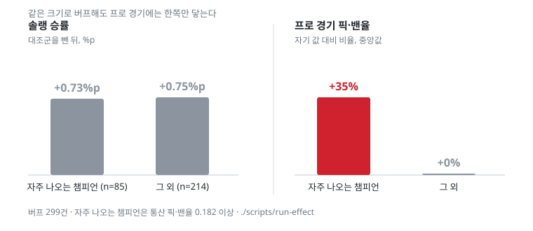

# 지금까지 보인 것

공개 데이터만으로 라이엇의 밸런스 조정을 얼마나 설명할 수 있는가. 2026-08-25 기준 결과다.

숫자는 전부 [`run-report`](../../scripts/run-report)가 낸 것이고 `runs/` 에 남는다. 시드 `20260824` · 시간순 분할 `15_13` 앞뒤.

## 한 줄

**「어느 쪽으로 조정할까」는 잘 맞고, 「누구를 조정할까」는 잘 안 맞는다.**

```
② 방향  너프냐 버프냐    AUC 0.900 (기준선 0.796)      ← 규칙으로 잡힌다
① 대상  누가 조정되나    R-정확도 27.4% (기준선 15.0% · 1.8배)  ← 잘 안 잡힌다
        누가 너프되나    R-정확도 22.9% (기준선  3.4% · 6.7배)  ← 좁히면 낫다
③ 효과  조정이 먹혔나    의도대로 79.5% · 균형 접근 53.3% (대조군 50.5%)
```

본 분석은 공개 데이터를 쓴다 — 솔랭 승률·픽률·밴율과 프로 경기 픽·밴.
한때 프로 경기를 확장 분석으로 따로 뒀는데, **도구는 이미 그것을 쓰고 있어 문서만
어긋나 있었다**([ADR 0008](../adr/0008-pro-play-in-the-main-analysis.md)). 솔랭만
쓰는 arm 도 표에 그대로 있으므로 「넣으면 얼마나 오르나」는 같은 자리에서 읽힌다.

## 지표 전체 (2026-08-29)

시간순 분할(`15_13` 앞뒤) · 평가 3,263행 · 시드 20260824. 문턱이 필요한
지표는 자르는 방식을 명시했다.

**이 절의 값은 전부 [`run-metrics`](../../scripts/run-metrics)가 낸다.** 손으로 적은
수치가 있으면 다음에 재현할 방법이 없어진다.

### ② 방향 — 조정된 챔피언이 너프냐 버프냐

**평가 228건(너프 110 · 버프 118), 다수 클래스 51.8%.** 균형 잡힌 이진분류다.

| 모델 | AUC | PR-AUC | 정확도 | 정밀도 | 재현율 | F1 | MCC | Brier | LogLoss |
| --- | ---: | ---: | ---: | ---: | ---: | ---: | ---: | ---: | ---: |
| 부스팅 | 0.878 | **0.879** | 79.9% | 76.7% | 84.6% | 0.805 | 0.602 | 0.143 | 0.441 |
| 회귀 | **0.885** | 0.877 | **80.8%** | **77.1%** | **86.3%** | **0.815** | **0.620** | **0.140** | 0.443 |

균형정확도는 부스팅 0.800 · 회귀 0.809 다.

프로 픽·밴을 넣은 `B5p` 는 AUC **0.900** 이다([프로 경기 절](#프로-경기가-무엇을-더-보나)).

### ① 대상 — 173종 중 누구를 볼 것인가

패치마다 재고 평균 낸다. 문턱은 K = 그 패치의 실제 조정 수라 **정밀도 = 재현율 = F1** 이다.

| 과제 | AUC | PR-AUC | P=R=F1 | MCC | 균형정확도 | 기준선 | 배수 |
| --- | ---: | ---: | ---: | ---: | ---: | ---: | ---: |
| ① 조정 | 0.625 | 0.276 | 0.274 | 0.144 | 0.572 | 15.0% | 1.8배 |
| **①′ 너프** | **0.794** | **0.263** | 0.229 | **0.201** | **0.601** | 3.4% | **6.7배** |
| ①″ 버프 | 0.724 | 0.188 | 0.153 | 0.122 | 0.561 | 3.6% | 4.3배 |

**방향으로 좁힐수록 좋아진다.** AUC·MCC·배수가 전부 너프에서 제일 높다. PR-AUC 0.258
은 기준선 0.034 의 **7.6배**다.

### 자르는 방식을 바꿔 봤다 — **F1 은 비슷하고 정밀도가 갈린다**

같은 라벨 3,263행, 같은 점수, 자르는 방식만 다르다.

| | 정밀도 | 재현율 | F1 | MCC | 정확도 | 몇 종이 걸리나 |
| --- | ---: | ---: | ---: | ---: | ---: | --- |
| 전부 「조정 안 됨」 | 0.0% | 0.0% | 0.000 | 0.000 | 85.3% | 0 |
| 점수 0.5 로 자른다 | 23.4% | 39.4% | 0.294 | 0.141 | 72.1% | 약 550종 |
| F1 최적 문턱 (0.44) | 19.9% | 60.0% | 0.299 | 0.131 | 58.6% | 더 많다 |
| 패치 안에서 K개 | 28.7% | 28.7% | 0.287 | **0.165** | 79.0% | 패치마다 다름 |
| **패치 안에서 상위 5** | **40.0%** | 7.9% | 0.132 | 0.124 | 84.7% | **항상 5종** |

**F1 로는 문턱과 순위가 사실상 같다**(0.287 vs 0.294 vs 0.299). 순위를 쓰는 이유는
성적이 아니라 **운영**이다 — 문턱으로 자르면 몇 종이 걸릴지 모르는데(어떤 패치는 80종),
밸런스 회의 전에 550종을 볼 수는 없다. **상위 5의 정밀도 40.0% 가 모든 방식 중 제일
높고, 개수도 고정된다.**

### 정확도로 보고하지 않는 이유

클래스가 85.3% 로 쏠려 있어 **아무것도 예측하지 않아도 정확도 85.3% 가 나온다.**
그래서 이 저장소는 정확도 대신 **기준선 대비 배수와 순위 지표**로 보고한다.

전 챔피언 5종 다중분류(너프·버프·adjust·mixed·조정 안 됨)를 그대로 돌리면 그것이
드러난다 — 정확도 0.850 인데 **Cohen κ 0.016**, macro F1 0.197 이다. 균형 가중을
주면 κ 0.071 로 오르고 정확도는 0.489 로 떨어진다. **모델을 다수 클래스로 도망가게
두면 지표가 좋아 보이는데 아무 일도 안 한 것이다.**

### 점수는 확률이 아니다

`class_weight="balanced"` 로 학습해 양성 쪽이 부풀려져 있다. 구간별 실제 조정률은
[아래](#점수를-확률로-읽으면-안-된다-2026-08-29)에 있다 — 「0.72」는 32% 쯤이다.
**Brier 0.134 · LogLoss 0.417 은 ② 에서만 재고**, ① 에서는 눈금을 안 맞췄다. 세 과제가
전부 줄 세우기라 필요가 없어서다.

## ① 대상 — 누가 조정되나

패치 안에서 챔피언 약 172종을 줄 세우고, 실제 조정된 수만큼 뽑아 맞힌 비율을 본다. 평가 20패치 · 3,433행 · 기준선 **15.0%**.

| arm | 방법 | R-정확도 | P@10 | AUC |
| --- | --- | ---: | ---: | ---: |
| A0 | 무작위 | 14.4% | 17.0% | 0.494 |
| A0b | 픽률 높은 순 | 21.4% | 26.0% | 0.548 |
| A0c | 승률 높은 순 | 15.7% | 16.5% | **0.448** |
| A0d | \|승률 − 0.5\| 큰 순 | 22.4% | 28.5% | 0.569 |
| A1 | 로지스틱 회귀 — 수준 | 25.8% | 31.5% | 0.589 |
| A2 | 로지스틱 회귀 — 수준 + 추세 | 26.6% | 31.5% | 0.592 |
| A2p | 로지스틱 회귀 — + **프로 경기** | 26.3% | 30.5% | 0.595 |
| A3 | 유사 사례 50개 (k-NN) | 24.0% | 28.0% | 0.611 |
| A4 | 규칙 엔진 — 대화 중 제안 | 23.2% | 32.0% | 0.554 |
| A5 | 사례 검색만 (RAG 검색부) | 23.1% | 29.0% | 0.586 |
| A5b | 사례 검색만 — 매 패치 갱신 | 21.3% | 28.5% | 0.591 |
| A2h | 로지스틱 회귀 — + 이력·역할 | 24.4% | 31.5% | 0.607 |
| A7 | 부스팅 트리 — 수준 + 추세 | 26.7% | 34.5% | 0.620 |
| A7h | 부스팅 트리 — + 이력·역할 | 27.1% | **36.0%** | 0.622 |
| **A7p** | **부스팅 트리 — + 프로 경기** | **27.4%** | 34.0% | **0.625** |

최고가 기준선의 1.8배다. 절대값이 27.4% 라는 것은 **넷 중 셋은 못 맞힌다**는 뜻이다.

예측 대상을 방향으로 좁힌 arm 은 아래 표에 따로 있다 — 기준선이 달라 여기
나란히 두면 오독한다.

### 세 번 밀어 봤을 때는 안 움직였다 — **조합 하나를 안 해 봤다**

한때 이렇게 적어 뒀다.

| 시도 | 전 | 후 |
| --- | ---: | ---: |
| **부스팅 트리** (표 데이터의 표준 강자) | 25.6% | **25.8%** |
| **이력·역할 피처** (최근 조정 횟수 등) | 25.8% | **25.6%** |
| **프로 경기 피처** — 회귀에 붙였다 (`A2p`) | 25.5% | **24.7%** |

그리고 「모델 한계가 아니라 데이터 한계다」로 결론지었다. **틀렸다.**

**프로 피처를 부스팅에는 안 붙여 봤다.**

| | R-정확도 | AUC |
| --- | ---: | ---: |
| `A7` 부스팅 | 26.7% | 0.620 |
| **`A7p` 부스팅 + 프로** | **27.4%** | **0.625** |

**시드 8개에서 전부 같은 값이다**(표준편차 0.000). 회귀는 피처를 더해서 쓰므로
「프로에서 세면서 솔랭 승률은 낮다」 같은 조건을 표현하지 못한다. 트리는 그
상호작용을 나눠 담는다 — [부스팅을 넣은 이유](../../src/lol_balance/arms.py)와
같은 논리다.

왜 회귀에서는 안 보였는지도 이제 안다. 프로 픽·밴율의 신호가 **방향에 따라
반대**라 「조정되나」 하나로 물으면 상쇄된다.

| | n | 프로 픽·밴율 | 「조정 안 됨」과 AUC |
| --- | ---: | ---: | ---: |
| **너프된 챔피언** | 285 | **0.244** | **0.647** |
| **버프된 챔피언** | 409 | **0.078** | **0.469** |
| mixed·adjust | 871 | 0.144 | 0.543 |
| 조정된 것 전부 | 1,565 | 0.145 | **0.543** |
| 조정 안 됨 | 7,037 | 0.110 | |

너프 쪽은 0.647, 버프 쪽은 0.469. 합치면 0.543 으로 뭉개진다.
**신호가 없어서가 아니라 상쇄돼서 안 보였다.**

### 예측 대상을 방향으로 좁히면 훨씬 잘 맞는다

| arm | 예측 대상 | R-정확도 | 기준선 | **배수** | AUC |
| --- | --- | ---: | ---: | ---: | ---: |
| `A7p` | 조정되나 | 27.4% | 15.0% | **1.8** | 0.625 |
| `A7nerf` | 너프되나 | 22.3% | 3.4% | **6.5** | 0.778 |
| `A7nerfp` | 너프되나 + 프로 | 22.9% | 3.4% | **6.7** | **0.794** |
| `A7buff` | 버프되나 | 11.1% | 3.6% | 3.1 | 0.706 |
| `A7buffp` | 버프되나 + 프로 | 15.3% | 3.6% | **4.3** | **0.724** |

R-정확도를 나란히 읽으면 안 된다. 좁힌 arm 은 패치당 양성이 적어(516 → 117)
기준선이 3%대다. **배수로 본다.**

「조정되나」로 물으면 1.8배인데 「너프되나」로 좁히면 6.7배다. 「조정 전부」에는
mixed·adjust 277건이 섞여 있고 그것이 거의 예측이 안 된다.

**프로 피처는 버프 대상에서 크게 산다**(R-정확도 11.1% → **15.3%** · AUC 0.706 →
**0.724**). 너프 대상에서도 이제 오른다(22.3% → 22.9% · 0.778 → 0.794).

이력 피처는 **신호가 분명히 있다** — 최근 5패치 조정 횟수가 늘수록 다음 패치 조정률이 16.9% → 35.4% 로 단조 증가하고, 기존 피처와 상관도 낮다(`pick_rate` +0.149 · `ban_rate` +0.190).

한때 「신호는 있는데 안 먹는다」로 적어 뒀다가 2026-08-27 에 뒤집었다. 패치 노트의 **핫픽스 절을 통째로 못 읽고 있었고**(53건), 핫픽스는 정확히 「방금 손댄 챔피언을 곧바로 또 손대는」 사례라 **이력 피처가 맞혀야 할 자리가 오답으로 채워져 있었다.** 고치니 `A7h` 가 `A7` 아래(25.6% < 25.8%)에서 위(27.1% > 26.7%)로 올라가고, 순열 중요도 합계도 −0.93% → **+0.34%** 가 됐다.

**그래도 `A7p`(27.4%)를 못 넘고, 패치 안 변별은 여전히 약하다**(AUC 0.545). 「이 챔피언이 자주 손대는 축인가」는 말하지만 「이번 패치에 손댈까」는 덜 말한다. 자세한 것은 [prediction-signals](../spec/prediction-signals.md#뒤집혔다-2026-08-27--핫픽스-누락이-이력-신호를-누르고-있었다).

### 천장을 쟀다 (2026-08-28) — **27.4% 에서 47.1% 사이가 남은 전부다**

「더 발전시킬 여지가 있나」를 재려고 **평가 구간 자체로 학습해 봤다.** 부정행위라
쓸 수 없는 값이지만, **이 피처로 낼 수 있는 상한**이 된다.

| | R-정확도 |
| --- | ---: |
| 정직하게 (학습 구간으로 학습) | **27.2%** |
| 부정행위 (평가 구간으로 학습) | **46.9%** ← 상한 |
| 완전한 정보 (라벨을 그대로) | 100% |

모델을 아무리 잘 만들어도 47.1% 를 못 넘고, 그것도 과적합으로 부풀려진 값이다.

#### 왜 그런지도 나왔다

상위 10 안에서 **맞은 것과 헛짚은 것이 거의 안 갈린다.**

| | n | 승률 | 픽률 | 밴율 | 판수 |
| --- | ---: | ---: | ---: | ---: | ---: |
| 맞음 | 68 | 0.489 | 0.103 | 0.181 | 118,017 |
| 헛짚음 | 132 | 0.482 | 0.081 | 0.136 | 96,995 |
| **놓침** | **448** | **0.500** | **0.060** | **0.050** | **60,927** |

놓친 448종은 승률이 정확히 5할이고 픽률·밴율이 낮다. 공개 지표에 아무 흔적이
없는데 조정된 것들이다. 위의 「어떤 규칙에도 안 걸리는 92건」과 같은 무리다.

하이퍼파라미터도 이미 학습 구간 3겹 교차검증으로 골라 뒀다. 여기서 더 짜낼
것이 거의 없다.

#### 그래서 남은 여지는 모델이 아니라 데이터에 있다

| 방향 | 무엇이 열리나 | 막힌 것 |
| --- | --- | --- |
| 다른 모집단(Elite · Average) | 개발사가 보는 판정 기준 넷 중 둘을 채운다 | **우리 구간에 5패치 이하** ([data-sources](../spec/data-sources.md#우리-구간의-티어-2026-09-01)) |
| 챔피언별 아이템 구매율 | 아이템으로 이뤄진 조정을 라벨에 넣는다 | **소급 수집이 안 된다** ([followups](../followups.md)) |
| 솔랭 듀오 통계 | 조합 너프를 잰다 | 같음 |
| 트랜스포머 임베딩 | R2 검색 품질 | 키 필요 · [하네스는 준비됐다](../../scripts/score-retrieval) |

그래서 「모델이 부족해서」도 「피처가 부족해서」도 아니다. 공개 신호로 「누가 조정될지」는 여기가 한계다.

#### 점수를 확률로 읽으면 안 된다 (2026-08-29)

`class_weight="balanced"` 로 학습해 **양성 쪽이 부풀려져 있다.** 평가 구간
3,263행을 구간별로 세면 이렇다.

| 도구가 낸 점수 | 행 | 실제로 조정된 비율 |
| --- | ---: | ---: |
| 0.2 ~ 0.4 | 1,463 | 11.6% |
| 0.4 ~ 0.5 | 1,149 | 13.2% |
| 0.5 ~ 0.6 | 502 | 19.3% |
| 0.6 ~ 0.7 | 221 | 27.6% |
| 0.7 ~ 0.8 | 63 | 31.7% |
| **0.8 ~ 1.0** | 28 | **50.0%** |

**「0.72」는 72% 가 아니라 32% 쯤이다.** 전체 평균은 15.0% 다.

쓸모는 절대값이 아니라 **순서**에 있다 — 10.7% 에서 57.7% 로 다섯 배 넘게
벌어진다. 눈금을 맞추지 않은 것은 세 과제가 전부 줄 세우기라 필요가 없어서다.
확률로 읽어야 할 자리가 생기면 그때 보정한다.

#### 방향으로만 묻는다 (2026-08-29)

**「조정되나」는 안 낸다.**

모델 쪽이 막힌 뒤(위 다섯 실패) 남은 지렛대는 **무엇을 묻느냐** 하나였다. 방향
좁히기와 컷을 같이 걸어 쟀다.

| 무엇을 보나 | 상위3 | 상위5 | 상위10 | 기준선 |
| --- | ---: | ---: | ---: | ---: |
| 조정 후보 | 38.3% | 38.0% | 34.0% | 15.0% |
| → 배수 | 2.5배 | 2.5배 | 2.3배 | |
| **너프 후보** | **31.7%** | 24.0% | 17.5% | **3.4%** |
| → 배수 | **9.3배** | **7.0배** | 5.1배 | |
| 버프 후보 | 16.7% | 13.0% | 11.5% | 3.6% |
| → 배수 | 4.7배 | 3.7배 | 3.2배 | |

**조정 후보가 정밀도는 제일 높은데 배수는 제일 낮다.** 기준선이 15.0% 라 아무나
찍어도 어느 정도 맞아서다. 도구가 값을 하는 자리는 **찍어서는 거의 안 맞는
질문**이고, 그것이 방향이다.

그래서 `predict` 에서 **「조정 후보」를 뺐다.** 셋을 나란히 내면 제일 안 쓸모
있는 것이 맨 위에 온다.

##### 컷은 5 로 뒀다

    패치당 실제 조정 수   중앙값 21 · 범위 11~41

      상위    정밀도   맞는 수   재현율
        3    38.3%     1.1     4.6%
        5    38.0%     1.9     7.9%
       10    34.0%     3.4    14.3%
       20    29.3%     5.9    24.7%
       40    24.3%     9.7    40.0%
      (조정 후보 기준. 방향별 값은 위 표)

**정밀도는 5에서 꼭대기를 찍는다.** 3 이 너프에서는 더 높지만(31.6% · 9.4배)
맞는 수가 1.0 종이라 목록이라기엔 얇다. 넓히면 정밀도가 단조로 내려간다.

**재현율은 숨기지 않는다.** 너프 상위5의 재현율은 한 자리 수다. 조정될 21종 중
대부분을 놓치고, 20 을 뽑아도 23% 다 — 순위를 넓혀서 해결되는 문제가 아니라
위의 천장이 그대로 나타난 것이다.

#### 모델 쪽을 아홉 번 밀어 봤다 (2026-08-29 · 08-31) — **전부 실패**

「천장이 있다」만으로는 정말 끝인지 알 수 없어, 안 해 본 조합을 골라 시험했다.
**고르는 것은 학습 구간 3겹 교차검증으로 하고 평가 구간은 승자 하나만 한 번
봤다** — 평가를 보고 고르면 그것이 누출이다.

| 시도 | 결과 |
| --- | --- |
| `A7hp` — 이력과 프로를 **같이** | CV 0.317 < `A7h` 0.334 ❌ |
| 시드 앙상블 5·15개 | 값이 한 자리도 안 바뀐다 — 부스팅이 결정적이다 ❌ |
| 부스팅 + 회귀 순위평균 | **CV 0.349 ↑ · 평가 0.260 < 0.272** ❌ |
| 확장 학습 (패치마다 재학습) | 조정 +0.007 · 너프 −0.031 · 버프 −0.014 ❌ |
| 목표를 「방향 있는 조정」으로 | 2.1배 vs 지금 1.9배 — 사실상 같다 ❌ |
| **판수로 학습 표본에 가중** | CV 0.3338 ≈ 0.3341 — 변화 없다 ❌ |
| **패치 안에서 피처를 표준화** | CV 0.3121 — 오히려 내려간다 ❌ |
| **R2 이웃 다수결** | 조정 0.9배 · 버프 0.6배 — 기준선 이하 ❌ |
| **R2 를 피처로** | CV 0.3401 ↑ · 평가 0.2708 ≈ 0.2714 ❌ |

**셋째를 남겨 둔다.** 세 겹 전부에서 올라 「됐다」고 볼 만했는데 평가 구간에서
뒤집혔다. **33패치 3겹으로는 0.015 차이를 못 가른다** — 다음에 같은 것을 시도할
사람이 같은 자리에서 속는다.

넷째는 `predict` 가 실제로 하는 방식이다. **조정은 조금 오르고 방향은 내려간다** —
최근 데이터를 더 넣는 것이 방향 예측에는 손해다. 19패치뿐이라 실제인지 잡음인지는
말할 수 없다.

첫째는 [README 가 적은 실수](../../README.md#결과)와 같은 종류를 노린 것이었다.
프로를 부스팅과 안 붙여 본 것이 26.7% → 27.4% 였으므로 이력도 그럴까 봤는데,
**이번에는 아니었다.**

##### 여덟째·아홉째 — **노트 검색(R2)은 왜 점수에 안 쓰이나** (2026-08-31)

R2 는 검색 성적이 제일 좋은데(MRR@10 0.946 · Recall@10 99.2%) **점수를 내는 arm 이
하나도 안 쓴다.** 안 해 본 것인지 안 되는 것인지 몰라 둘 다 해 봤다.

**여덟째 — R1 과 같은 구조로, 거리만 텍스트.** 「노트가 비슷했던 챔피언들은 그 뒤
어떻게 됐나」를 다수결한다.

    학습 23패치      R2 arm    기준선     배수
    조정             18.3%    20.7%    0.9배   ← 기준선 이하
    너프              4.2%     3.6%    1.2배
    버프              3.3%     5.3%    0.6배   ← 기준선 이하

**아홉째 — 이웃이 아니라 피처로.** 노트에 마지막으로 나온 지 몇 패치인지, 최근
5전환에 몇 번 나왔는지, 그때 몇 줄이 바뀌었는지 셋을 `A7h` 에 붙였다.

    A7h              CV 0.3341   평가 0.2714
    A7h + 노트 피처    CV 0.3401   평가 0.2708   ← 또 전이가 안 된다

**왜 안 되는지는 뜻이 통한다.** 노트 텍스트는 **「무엇이 바뀌었나」**를 적지
**「다음에 누가 바뀌나」**를 적지 않는다. 같은 「피해량 너프」 문장을 가진 두
챔피언이 다음 패치에 같은 일을 겪을 이유가 없다.

**검색이 정확한 것과 그 검색이 예측에 쓸모 있는 것은 다르다.** R2 는 앞엣것에서
98.1% 이고 뒤엣것에서 기준선 이하다. 둘을 따로 재 두지 않았으면 「RAG 를 붙였으니
좋아졌겠지」로 넘어갔을 것이다.

**R2 는 그래서 `ask` 와 배포 페이지에만 남는다** — 사람이 읽을 근거로는 값을 하고,
점수로는 안 한다. 에이전트가 생기면 다시 볼 자리이기도 하다.

##### 여섯째·일곱째는 데이터 감사에서 나왔다 (2026-08-31)

「데이터가 이상한 것 아닌가」를 확인하려고 패널을 감사했다. **구조는 멀쩡했다.**

    승률 평균 0.5006 · 표준편차 0.0147 · 5할±5%p 밖 0.5%
    패치별 평균 승률   53패치 전부 0.498~0.502   ← 치우침이 없다
    픽률 합           정확히 10.00              ← 5역할 × 2팀. 파싱이 정확하다
    챔피언 163~173종

**연속 패치 승률 상관이 판수로 완전히 설명된다.**

    14_5  → 14_6    0.243      판수   3,159 →   1,335
    13_16 → 13_17   0.439            8,308 →   1,131
    16_12 → 16_13   0.942           85,094 → 112,546
    15_19 → 15_20   0.948           75,277 →  71,847

즉 **편향이 아니라 잡음이다** — 값이 치우친 게 아니라 흔들린다. 편향이면 패치 평균이
5할에서 벗어나는데 안 벗어난다.

여기서 **학습 구간(2023년 판수 중앙값 3,649)이 평가 구간(2026년 68,869)보다 훨씬
잡음이 많다**는 것이 드러났다. 흐릿한 데이터로 배워 선명한 데이터로 시험보는 셈이라,
① 판수로 학습 표본에 가중을 주고 ② 평가가 패치 안 줄 세우기이므로 피처도 패치 안에서
표준화해 봤다. **둘 다 안 됐다.**

하이퍼파라미터는 **학습 구간 안에서 시간순 3겹 교차검증으로** 골랐다. 평가 구간을 보고 고르면 그것이 곧 누출이다.

**승률 순(A0c)이 무작위보다 나쁘다**(AUC 0.448). 조정되는 쪽이 양 끝이라 단조롭지 않다. 거리로 바꾸면(A0d) 0.569 로 뒤집힌다.

#### 데이터 쪽을 밀어 봤다 — **아홉 갈래 · 93회 측정, 걸린 것 2건 · 채택 0** (2026-09-01)

모델을 아홉 번 민 것이 다 실패했으므로 이번에는 **입력을 늘렸다.** 「무엇을 보고
너프하고 버프하는가」의 근거를 최대한 찾아 피처로 만들고 같은 잣대로 쟀다.

**절차를 하나로 고정했다.** 갈래마다 다르게 재면 비교가 안 된다.

    1. 학습 구간(13_14 ~ 15_12)에서 패치 하나씩 앞으로 밀며 20겹
    2. 짝지은 차이의 평균 ± 표준오차. 2 표준오차를 넘어야 「걸렸다」
    3. 걸린 것만 평가 구간을 한 번 본다

피처를 붙이는 arm 은 `A7p` 다. 기준값은 ① 0.3412 · ①′ 0.2656(둘 다 R-정확도) ·
② 0.9118(AUC) 이다. **이 93회는 저장소와 다른 설정으로 쟀다** — 거르는 쪽이라
`class_weight="balanced"` 를 뺐고, 그래서 여기 값은 공개된 `A7p` 27.4%(평가 구간)와
같은 자리의 숫자가 아니다. 살아남은 후보는 저장소 설정으로 다시 쟀다.

| 갈래 | 넣은 것 | ① 조정 | ①′ 너프 | ② 방향 |
| --- | --- | ---: | ---: | ---: |
| 프로 경기 승률·성적 | `result` 로 만든 프로 승률, 프로−솔랭 승률 차, KDA·골드 점유·15분 격차 | −0.016 | +0.048 | +0.004 |
| 어느 리그에서 나오나 | 메이저 비중, 플레이오프, 리그 수·집중도, LCK·LPL·LEC별 | −0.005 | +0.040 | +0.006 |
| 밴·픽 우선순위 | 몇 번째로 밴됐나. 1밴 비율, 첫 픽 비율 | +0.003 | +0.019 | +0.016 |
| 프로 지표의 추세 | 프로 픽·밴·승률의 직전 대비 변화, 지연·누적 | −0.021 | +0.009 | −0.006 |
| 패치 달력 | 연중 위치, 직전 패치와의 간격, 그때 돌던 리그 | −0.001 | −0.001 | +0.018 |
| 아이템 격변 | 그 챔피언이 쓸 만한 아이템이 바뀌었나 | +0.001 | +0.031 | +0.019 |
| 어떤 종류로 바뀌어 왔나 | 최근 diff 를 기본 수치·계수·쿨다운·코스트·사거리로 나눠 셈 | −0.011 | +0.015 | +0.009 |
| 스킨·출시 시점·클래스 | 스킨 줄 수, 출시 후 패치 수, 라이엇 자체 난이도, 클래스 | +0.007 | −0.008 | −0.006 |
| **공개 밸런스 기준** | 개발사가 공개한 문턱 그대로 — 아래 절 | +0.009 | +0.010 | +0.021 |

93회 중 2 표준오차를 넘은 것이 **2건**이다. 서로 독립이라고 치면 우연히 넘을 것이
**93 × 0.05 ≈ 4.7건**이다(2 표준오차의 양측 확률 0.0455 로 잡으면 4.2건).
피처 묶음이 서로 겹치고 20겹이라 독립도 아니다. 걸린 수가 그보다 적다.

##### 잡음 열을 넣어 봤다 — **①′ 의 양수는 난수와 못 가른다**

위 표는 갈래마다 **열을 전부 넣었을 때**다. 실제로는 갈래를 피처 묶음 31개로
쪼개 3과제씩 93회를 쟀고, **「전부」를 뺀 묶음 22개 중 20개에서 ①′ 너프가
양수다.** 「신호는 있는데 표본이 모자란다」로 읽을 수도 있어, 아무 뜻 없는
난수 열을 같은 수만큼 넣어 봤다.

    난수 열         ① 조정              ①′ 너프             ② 방향
      2개    +0.0011 ±0.0023   +0.0121 ±0.0078   −0.0040 ±0.0029
      6개    −0.0091 ±0.0044   +0.0133 ±0.0058   −0.0013 ±0.0069
     12개    −0.0060 ±0.0026   +0.0286 ±0.0120   +0.0094 ±0.0066
     20개    −0.0222 ±0.0022   +0.0061 ±0.0095   −0.0073 ±0.0079
                                              (씨앗 5개 · ± 는 씨앗 간 표준오차)

**난수만 넣어도 ①′ 가 열 수에 따라 +0.006 ~ +0.029 움직인다.** 위 표의 작은
양수(+0.009 ~ +0.031)는 그 폭 안팎이다 — 제일 큰 아이템 격변 +0.031 ±0.0197 도
자기 표준오차 안에서 난수와 갈리지 않는다. 큰 둘 — 프로 승률·성적 +0.048
±0.0236 과 리그 +0.040 ±0.0211 — 은 난수 평균보다 크지만 **자기 표준오차가
그만큼 커서 난수와 구별되지 않는다.** 「난수 수준이다」가 아니라
**「난수와 못 가른다」**다.

**①′ 는 열을 더하면 움직인다.** 단조롭지 않다 — 12열이 제일 높고 20열이 제일
낮다. 씨앗 다섯 사이 표준오차도 ±0.008 안팎이라 바닥 자체가 흔들린다. 패치당
실제 너프가 2~11종(중앙값 4.5)이라 R-정확도가 한 종에 0.09~0.5씩 튀는 것이
그 아래에 있다.
반대로 ① 은 열을 더하면 내려간다(난수 20열에 −0.022). **표의 ① 음수도 신호가
나쁘다는 뜻이 아니라 열을 더한 대가다.**

잡음 열을 안 뒀으면 「프로 승률이 너프 예측을 4.8%p 올린다」로 적었을 것이다.

##### 남은 하나 — 직전 패치의 버프 비율

난수 바닥 위에 남은 것은 하나다. **직전 패치에 이뤄진 조정 중 버프가 몇 %였나**
(`buff_ratio_1`)를 ② 방향에 넣으면 **+0.0218 ±0.0084** 다. 20겹 중 11겹에서
오르고 내린 겹은 0, 제일 큰 겹을 빼도 +0.0141 ±0.0037 로 남는다.

(`buff_ratio_3` 을 같이 넣으면 +0.0174 ±0.0061 로 희석된다 — 그 열 단독은
−0.0049 ±0.0107 로 방향조차 없다. **3패치 누적이 아니라 직전 하나가 신호다.**)

**패치 안에서 상수인 값이 어떻게 줄 세우기를 바꾸나.** 트리가 그 값으로 갈라
「직전이 버프 편중이었을 때」와 아닐 때 승률을 다르게 읽는다. 상수 이동이 아니라
조건 분기다.

**그런데 저장소 설정으로 재면 문턱 아래로 내려간다.** 이번 93회는
`class_weight="balanced"` 를 빼고 쟀는데, 저장소의 `_boosting()` 을 그대로 쓰면
+0.0139 ±0.0075 로 **1.9 표준오차**가 되고 오른 겹도 11에서 6으로 준다.

평가 구간은 한 번 봤다 — 저장소 `_boosting()` · `buff_ratio_1` 단독이다.

    ① 조정    0.2739 -> 0.2827   (+0.0088)
    ①′ 너프   0.2287 -> 0.2408   (+0.0121)
    ② 방향    0.8780 -> 0.8866   (+0.0085)

셋 다 오르는 쪽이다. **그래도 채택하지 않는다.** 미리 정한 절차로는 2 표준오차를
넘었지만(2.6) 저장소 설정으로는 1.9 다. 같은 홀드아웃을 이번 93회의 설정으로
재면 ① +0.0064 · ①′ **−0.0004** · ② +0.0043 이라 **①′ 는 오르지도 않는다** —
**설정 하나에 뒤집히는 크기다.**
[셋째 실패](#모델-쪽을-아홉-번-밀어-봤다-2026-08-29--08-31--전부-실패)가 학습
구간 세 겹 전부에서 올랐다가 평가 구간에서 뒤집힌 자리였다.

#### 개발사가 공개한 기준 (2026-09-01)

지금 저장소의 규칙 12개는 전부 **데이터에서 뽑은 것**이다. 개발사가 공개한 기준이
따로 있다 — 「/dev: Champion Balance Framework」(2019)와 그 갱신본(2020)이다
(주소는 [data-sources](../spec/data-sources.md#6-공개-밸런스-기준--개발사가-적어-둔-문턱)).
근거의 출처가 달라 따로 대 봤다. **2019·2020년에 공개한 것이고 지금도 이대로인지는
모른다.**

| 모집단 | 세다 | 약하다 |
| --- | --- | --- |
| Average (상위 10% 밖) | 승률 54.5%(밴율 평균 이하) ~ 52.5%(평균의 5배). 2020년에 상단을 0.5%p 조였다 | 승률 49% |
| **Skilled (상위 10%)** | 승률 54% ~ 52%, 2020년 갱신 뒤 **53.5% ~ 51.5%** — 피처가 쓰는 값이다 | 승률 49% |
| Elite (상위 0.5%) | **밴율 45%** — 승률은 표본이 얇아 안 쓴다 | 프로 픽·밴율 5% |
| 프로 (상위 5리그) | 프로 픽·밴율 90%, 또는 연속 패치 80% | 프로 픽·밴율 5% |

판정은 **「어느 한 모집단에서라도 상단을 넘으면 세다」**이고, 약한 쪽은
**「모든 모집단에서 하단 아래일 때」**다. 그리고 2020년에 안전장치가 붙었다 —
「연이은 패치의 조정 중 절반 넘게 버프면, 역할별 프로 픽·밴율 1위와 Skilled
역할별 성적(승률+밴율) 1위도 너프를 검토한다」.

**문턱 위에서 조정이 더 잦다.** 학습 구간 5,334행에서 세어 보면 그렇다.

    Skilled 상단을 넘음      105행   조정률 42.9%   (안 넘은 5,229행 19.8%)
    어느 모집단에서든 넘음     147행   조정률 44.2%   (5,187행 19.5%)
    역할별 성적 1위          160행   조정률 45.6%   (5,174행 19.4%)
    하단 아래               1,183행   조정률 26.6%   — 그 315건 중 버프 50.2% ·
                                                  adjust 31.1% · mixed 13.7% ·
                                                  **순수 너프는 5.1%뿐**

**이것은 상관 하나다.** 그 선 위에서 조정이 더 잦았다는 것뿐이고, 개발사가 이
선을 보고 조정했는지는 이 데이터로 알 수 없다.

**모델에 넣으면 2 표준오차를 못 넘는다.** 문턱만 뽑은 묶음이 솔랭 ①′ +0.0288
±0.0181 · ② +0.0201 ±0.0119, 프로 ② −0.0065 ±0.0079 다(갈래 표의 마지막 줄
② +0.021 은 문턱이 아니라 버프 편중 열에서 온다). 문턱이 승률·밴율로 만든 값이라
모델이 그 둘을 이미 본다는 설명이 가능하지만 **그것은 해석이고 재지 않았다.**

**문턱보다 중요한 것은 모집단이 넷이라는 점이다** —
[밝혀 두는 한계](#모집단-넷-중-둘만-본다)에 적었다.

**공개된 버프 편중 안전장치는 우리 구간에서 한 번도 안 켜진다 — 3패치 창으로
읽었을 때다.** 조건이 「연이은 패치의 조정 중 절반 넘게 버프면」인데 「연이은」이
몇 패치인지는 안 적혀 있어 **창은 우리가 골랐다.** 최근 3패치로 재면 버프 비율이
**중앙값 27.3% · 최대 47.3%** 로 전 구간에서 50% 를 안 넘는다. **직전 1패치로
읽으면 넘는 패치가 하나 있다** — `13_22` 의 56.8% 다. 2023~2026 패치는 대체로
너프 편중이다.

##### 붙일 arm 을 잘못 고를 뻔했다 — **`A7h` 로 재면 안 나올 것이 나온다**


처음에는 스킨·출시 시점을 `A7h`(이력·역할)에 붙여 쟀고 ① +0.022 · ② +0.036 이
나왔다. 둘 다 2 표준오차를 넘어 「걸렸다」로 볼 뻔했다.

**최고 arm 은 `A7h` 가 아니라 `A7p`(프로 경기) 다.** 붙일 arm 을 옮기니 전부 1 표준오차
안으로 들어갔다. 스킨 줄 수는 픽률과 상관 +0.26 인 인기 대리 지표인데, **프로
픽·밴율이 이미 같은 것을 더 직접 재고 있다.**

**약한 arm 에 붙이면 겹치는 신호가 이득처럼 보인다.** 새 피처는 그 과제의 최고
arm 에 붙여야 한다.

## ② 방향 — 너프냐 버프냐

② 를 올릴 후보를 데이터 쪽에서 아홉 갈래 찾아봤고 하나만 남았다 —
[직전 패치의 버프 비율](#남은-하나--직전-패치의-버프-비율). **채택하지 않았다.**

조정된 챔피언만 본다. **평가 239건**(너프 117 · 버프 122) · **다수 클래스 기준선 51.0%.**

여기 실린 arm 은 전부 솔랭 지표만 본다. 프로 경기를 쓰는 넷은
[프로 경기 절](#프로-경기가-무엇을-더-보나)에 있다.

표본을 두 번 늘렸다 (2026-08-26).

| | 표본 | 손 라벨 |
| --- | ---: | ---: |
| 처음 | 396 | 242 · 11패치 |
| CommunityDragon 방향 판정 추가 | 576 | 242 |
| 손 라벨 6패치 추가 | 597 | 424 · 17패치 |
| 손 라벨 6패치 더 | 608 | 618 · 23패치 |
| **남은 29패치 전량** | **695** | **1,555 · 52패치** |
| **핫픽스 절·이름 어긋남 수정 (2026-08-27)** | **697** | **1,555 · 52패치** |
| **핫픽스 라벨 44종 추가 (2026-08-27)** | **710** | **1,599 · 52패치 · 커버리지 100%** |

아래 화살표는 첫 표본(396) 대비다. `◆` 는 프로 픽·밴을 쓰는 arm 이고, 나머지는 솔랭 지표만 쓴다 — **`B6` 의 판단이 솔랭 맥락을 읽고 매긴 것이라 그것과 나란히 놓아야 공정하다.**

| arm | 방법 | AUC | 정확도 |
| --- | --- | ---: | ---: |
| B0 | 무작위 | 0.533 | 52.3% |
| B0c | 밴율 높은 순 | 0.751 | — |
| B0d | 픽률 높은 순 | 0.761 | — |
| B3 | 유사 사례 25개 (k-NN) | 0.770 ↑0.708 | 71.1% |
| B0b | 승률 높은 순 | 0.796 ↓0.836 | — |
| **B6** | **사례 검색 + 판단 — 대화 중** (229/239종) | **0.830** | **77.7%** |
| B1 | 로지스틱 회귀 — 수준 | 0.834 ↑0.759 | 75.7% |
| **B4** | **규칙 엔진 — 대화 중 제안** | **0.837** ↑0.807 | 77.4% |
| B2 | 로지스틱 회귀 — 수준 + 추세 | 0.839 ↑0.778 | 74.5% |
| B2h | 로지스틱 회귀 — + 이력·역할 | 0.841 ↑0.785 | 76.2% |
| B7h | 부스팅 트리 — + 이력·역할 | 0.846 ↑0.832 | 74.9% |
| B5b | 사례 검색만 — 매 패치 갱신 | 0.850 | **78.2%** |
| B5s | 사례 검색만 — `B6` 과 같은 229종 | 0.850 | 76.0% |
| B7 | 부스팅 트리 — 수준 + 추세 | 0.850 ↑0.837 | 75.3% |
| B5 | 사례 검색만 (RAG 검색부) | 0.856 | 75.7% |
| ◆ B1p | 로지스틱 회귀 — + 프로 | 0.880 | 80.8% |
| ◆ B2p | 로지스틱 회귀 — + 추세 + 프로 | 0.885 | 80.8% |
| **◆ B5p** | **사례 검색 — + 프로 · 거리가중** | **0.900** | 74.9% |

`B5` 는 「RAG」가 아니라 그 검색부다. RAG 는 검색해서 **생성**한다는 뜻인데
`B5` 는 이웃 `k` 개를 찾아 **라벨을 다수결**한다 — 생성 단계가 없다. 그 위에
판단을 올린 것이 `B6` 이고, 용어는 [glossary](../glossary.md#rag--판단을-올려-봤고-못-이겼다)에 있다.

대화 산출물 둘 다 통계를 못 이겼다.

| | | |
| --- | --- | --- |
| `B4` 규칙 | 0.837 | 로지스틱 회귀(`B2h` 0.841)에 **살짝 진다** |
| `B6` 판단 | 0.830 | 같은 229종의 다수결(`B5s` 0.850)에 **져 보이지만 유의하지 않다** |

이것이 [CLAUDE.md](../../CLAUDE.md) 가 요구하는 비교다 — **통계 베이스라인 없이
LLM 성능을 주장하지 않는다.** 이기지는 못했고, 못 이겼다고 적는다.

최고는 프로를 쓴 사례 검색(`B5p` 0.900)이다. 승률 한 줄(`B0b` 0.796)보다
+0.104, 다수 클래스로 찍기(0.510)보다 훨씬 위다. 솔랭만으로는 `B5` 0.856 이고,
**그 차이 +0.044 가 프로 경기가 더 보는 것**이다.

### 검색 위의 판단(B6)이 왜 다수결을 못 이기나

`B5` 와 **같은 이웃 25종**을 놓고 대화 안에서 0~100 점을 매기고 근거를 적었다.
평가 239건 중 **229건**이다 — 핫픽스 라벨 44종을 붙이며 평가 구간이 늘었고 그
행들에는 판단이 없다. 표본이 다르면 짝지어 비교가 안 되므로 `B5` 도 같은
229종으로 잘라 `B5s` 로 함께 실었다.

판단을 새로 만들지 않는 이유는 오염이다. 빠진 10종 중 9종은 **핫픽스 라벨을
붙이는 바로 그 자리에서** 방향을 정한 것들이다. 지금 판단을 적으면 판단이 아니라
답을 옮겨 적는 것이 된다. 익명화가 막는 것은 「예전에 붙인 라벨을 기억하는가」이지
(상한 검정 AUC 0.505), 「방금 붙인 것을 아는가」가 아니다.

빠진 것이 무작위가 아니라는 점은 따로 봐야 한다. 같은 `B5` 로 두 집단을 재면
이렇다.

```
전체 239종      AUC 0.856
판단 있는 229종  AUC 0.850    ← B6 이 실제로 겨루는 구간
빠진 10종       AUC 1.000     n=10, 크기가 못 믿을 값이다
```

빠진 쪽이 쉬운 쪽이다. 그래서 `B6` 0.830 을 239종에서 잰 `B5` 0.856 과 나란히
놓으면 **`B6` 을 실제보다 나쁘게 본다.** `B5s`(0.850)가 옳은 상대다.

```
B5  같은 이웃 다수결   AUC 0.850   정확도 76.0%   점수 25종
B6  같은 이웃 + 판단   AUC 0.830   정확도 77.7%   점수 50종
```

차이 −0.020, 95% [−0.045, +0.004]. 짝지어 부트스트랩 2만 회에서 **구간이 0 을
포함한다** — `B6` 이 더 높을 확률 5.1%. **한때는 0 을 안 넘었는데**(−0.031,
[−0.057, −0.005]) 표본이 234 → 229 종으로 바뀌며 경계로 왔다. **「진다」가 아니라
「이긴다고 말할 수 없다」가 지금 말할 수 있는 전부다.**

해상도는 병목이 아니었다. 점수 종류가 25 → 50 으로 두 배가 됐는데 AUC 는
내려갔다. `B4` 에서 해상도를 고쳐 0.807 → 0.837 이 된 것과 다르다.

판단이 검색에 닻을 내리는 것으로 보인다. 같은 이웃을 보므로 이웃이 틀린
곳에서 같이 틀리고, 이웃이 하나도 없는 대상(약 20%)에서는 승률·밴율만으로
판단하게 된다.

#### 판단자의 오염은 재서 배제했다

방향 라벨 1,599종을 대화 안의 Claude 가 붙였고 그것이 곧 채점 정답이다.
「기억 안 난다」는 검증할 수 없으므로 열쇠를 없애고 상한을 쟀다.

| 조건 | 주는 것 | n | AUC |
| --- | --- | ---: | ---: |
| `anon` | **이름 없이** 수치 · 이웃 · 노트 | 234 | 0.834 |
| `named` | **이름과 패치만.** 수치도 사례도 없다 | 80 | **0.505** |
| `named` — 이 대화에서 정답을 본 6건 제외 | | 74 | **0.421** |

찍기와 구별이 안 된다. 「일부러 50 점으로 채운 것 아니냐」에 대한 답도
데이터에 있다 — 아는 6건에는 20·25·65·70·80 점을 매겼다.

설계와 되돌린 판단은 [ADR 0006](../adr/0006-rag-generation-and-contamination-control.md)에 있다.

표본을 늘리니 순위가 뒤집혔다. 이것이 이번에 얻은 가장 중요한 것이다.

| | 전 | 후 |
| --- | ---: | ---: |
| 승률 한 줄 (B0b) | **0.836** | 0.803 |
| 로지스틱 회귀 (B1) | 0.759 | **0.813** |

전에는 **「승률 한 줄이 피처 열한 개짜리 회귀를 이긴다」**고 적었다. **그것이 표본
편향이었다.** 옛 표본은 Data Dragon 이 보는 것 — 기본 스탯·쿨다운 조정 — 에
쏠려 있었고, 그 부분집합에서는 승률이 유난히 잘 먹혔다. **피해량만 바뀐
챔피언을 넣자 승률 한 줄이 무너지고 회귀가 올라섰다.**

「단순한 것이 이긴다」는 결론은 **그 표본에서만 참이었다.**

**정교한 arm 들은 조금씩 내려갔다**(B4 −0.032 · B5 −0.009 · B7 −0.009). 새로
들어온 222종이 더 어렵다는 뜻이다.

**B4 의 규칙을 다시 제안해 봤는데 안 올랐다**(0.809 → 0.811). 새 규칙 셋이
개별로는 평가에서 80~96% 인데 **기존 규칙과 100% 가까이 겹쳐** 172건 중 1건만
새로 덮는다. 남은 28건은 승률이 정확히 5할이라 **공개 지표가 어느 쪽으로도
기울지 않는다.** 자세한 것은 [balance-rules](balance-rules.md).

**B5(사례 검색)가 가장 덜 흔들렸다**(−0.009).

### 손 라벨을 전량으로 늘렸다 — **커버리지 100%**

242 → 424 → 618 → 1,555 → **1,599** (11 → 17 → 23 → **52패치**). 1,606종 중 1,599종이고
빠진 7종은 그 패치에 처음 나온 챔피언이다. **충돌은 끝까지 0 이다**(채점 대상 407종).

`◆` 는 프로 경기를 쓰는 arm 이다.

| arm | 242 | 424 | 618 | **1,555** |
| --- | ---: | ---: | ---: | ---: |
| ◆ B2p 수준+추세+프로 | — | — | 0.860 | **0.885** |
| ◆ B1p 수준 + 프로 | 0.856 | 0.863 | 0.877 | 0.880 |
| **B5 사례 검색** | 0.854 | 0.851 | 0.857 | **0.856** |
| B7 부스팅 | 0.828 | 0.838 | 0.836 | 0.850 |
| B1 회귀 — 수준 | 0.813 | 0.814 | 0.826 | 0.834 |
| B4 규칙 | 0.811 | 0.800 | 0.798 | 0.837 |

마지막 열은 **2026-08-27 재측정**이다(핫픽스 절·이름 어긋남 수정 뒤). `B4` 만
앞 열들과 결이 다른데, 그 사이에 **점수 해상도를 고친 것**이 겹쳐서다 —
0.807 → 0.837 의 경위는 아래 「규칙은 0.807 이었다」에 있다.

라벨을 늘릴 때마다 거의 모든 arm 이 올랐다. 첫 확장에서 결론 둘이 뒤집힌
뒤로는 순위가 흔들리지 않고 값만 올라갔다 — **표본이 부족해서 낮게 나오고 있었다.**

`B4` 규칙만 0.807 로 뒤처지는데, 규칙이 덮지 못하는 자리 — 승률이 정확히 5할인
챔피언들 — 은 라벨이 늘어도 그대로이기 때문이다.

## 프로 경기가 무엇을 더 보나

한때 본 분석 밖에 뒀다. 질문을 「**지금 솔랭 지표로** 예측할 수 있는가」로
잡았기 때문인데, **도구는 이미 프로를 쓰고 있어 문서만 어긋나 있었다**
([ADR 0008](../adr/0008-pro-play-in-the-main-analysis.md)). 지금은 본 분석에
들어가고, 이 절은 **프로가 무엇을 더 보는지**를 남긴다.

Oracle's Elixir 프로 경기 픽·밴(**29,977경기 · 72패치**). 패널 커버리지 98.1%,
**평가 구간은 100%** 라 비교 자체는 공정하다 — 결측 때문에 뺀 것이 아니다.

| arm | 방법 | AUC | 정확도 | 솔랭만 대비 |
| --- | --- | ---: | ---: | ---: |
| B1p | 로지스틱 회귀 — 수준 + 프로 | 0.880 | 80.8% | B1 **+0.046** |
| B2p | 로지스틱 회귀 — 수준 + 추세 + 프로 | 0.885 | **80.8%** | B2 **+0.046** |
| **B5p** | **사례 검색 — + 프로 · 거리가중** | **0.900** | 74.9% | B5 **+0.044** |
| A2p | **① 대상** — 로지스틱 회귀 + 프로 | 0.595 | — | A2 **+0.003** |

② 에서는 듣고 ① 에서는 안 듣는다. 프로 팀이 밴으로 「이게 세다」를 표시하지만
라이엇이 **누구를 건드릴지**는 그것으로 안 갈린다. `A2p` 를 ① 본 분석 표에 남겨 둔
이유가 이것이다 — **「겹치지 않는 신호를 더해도 안 오른다」가 ① 의 결론(데이터
한계)을 강화한다.**

### 어디서 갈리는가 — **승률 50% 미만인데 너프당한 69종**

솔랭만 보면 전부 「약하니 버프」로 읽어야 하는 구간이다.

| | n | 프로 픽·밴율 평균 |
| --- | ---: | ---: |
| 그런데 **너프당했다** | 69 | **0.361** |
| 버프받았다 | 295 | 0.077 |

**4.7배다.** 이 구간에서는 프로 픽·밴율이 승률보다 잘 가른다(AUC 0.754 vs 0.672).

```
Ryze   16_2   승률 0.483  솔랭밴 3.4%  프로밴 23.6%  프로픽 33.3%  → 너프
Jayce  16_13  승률 0.487  솔랭밴 6.9%  프로밴 42.2%               → 너프
Jinx   15_18  승률 0.509  솔랭밴 1.6%  프로밴  1.1%               → 버프
```

승률과 상관이 0.06~0.10 밖에 안 된다. 프로 밴율 단독 AUC 는 0.661 로 승률
(0.796)보다 **약한데도** 보태면 오르는 이유가 이것이다 — **더 센 신호가 아니라
다른 신호다.**

### 원인은 확정하지 못했다

후보 셋 중 둘을 지웠고 하나가 안 풀렸다. **「라이엇이 프로 경기를 본다」로는 적지
않는다** — 이 데이터로 알 수 있는 것이 아니다. 검정 내역과 되돌린 판단은
[followups 10번](../followups.md)에 있다.

### 두 지표가 어긋난다

솔랭 승률과 프로 픽·밴율은 상관이 0.06~0.10 밖에 안 된다. 서로 다른 것을 재고
있고, **조정 한 번이 양쪽에 닿는데 챔피언마다 배분이 다르다.**

용어는 [glossary](../glossary.md)에 있다. 여기서만 쓰는 것은 둘이다.

| | |
| --- | --- |
| **자주 나오는 챔피언** | 통산 프로 픽·밴율 **상위 25%**(0.182 이상)인 챔피언 42종 |
| **높은 쪽 / 낮은 쪽 너프** | 조정 직전 프로 픽·밴율이 **중앙값 위 / 아래**인 너프 |

픽·밴율 변화는 %p 가 아니라 자기 값 대비 비율이다. 챔피언마다 자릿수가 달라
(0.55 와 0.04) %p 로는 비교가 안 된다. 솔랭 승률만 %p 다.

버프 — 솔랭에는 똑같이, 프로 경기에는 다르게 닿는다.

| | n | 솔랭 승률 | **프로 픽·밴율** |
| --- | ---: | ---: | ---: |
| 자주 나오는 챔피언 | 85 | +0.73%p | **+35.0%** |
| 그 외 | 214 | +0.75%p | **+0.0%** |



**이 값은 [`run-effect`](../../scripts/run-effect)가 낸다** (2026-08-31). 그림은
[`make-effect-svg`](../../scripts/make-effect-svg)가 같은 함수를 불러 그리므로
**표와 그림이 갈릴 수 없다.** 한때
`87 / +37.1%` · `244 / +0.0%` 로 적혀 있었는데, 그것은 대화 중에 계산하고 스크립트로
남기지 않은 값이었다. 스크립트로 만들어 다시 재니 표본과 값이 조금 달라졌다.
**결론은 같다 — 자주 나오는 챔피언만 뛴다.**

솔랭 지표만 보면 이 차이가 안 보인다. 같은 크기로 올려 줬는데 한쪽만 프로 경기에서 뛴다.

#### 너프 쪽은 재현되지 않는다 — **열어 둔다** (2026-08-31)

    적혀 있던 값 (2026-08-27 재측정)   자주 나오는 61 −18.0%   그 외 160 −17.5%
    스크립트가 내는 값                  자주 나오는 62 −14.6%   그 외 152 −19.4%
    그전에 적었다가 철회한 값            자주 나오는    −14.6%   그 외     −23.1%

**스크립트가 내는 값이 철회된 옛 값과 거의 같다.** 재측정의 근거가 「핫픽스 라벨
44종을 붙이고 다시 쟀다」인데 그 라벨은 지금 패널에 다 들어가 있고(커버리지 100%),
그런데도 재측정 값이 안 나온다.

셋 중 무엇인지 **아직 모른다.**

| | |
| --- | --- |
| 가 | 재측정이 여기와 다른 필터를 썼다 |
| 나 | 재측정이 틀렸고 철회가 잘못이었다 |
| 다 | 이 스크립트가 재측정과 다른 것을 재고 있다 |

**어느 쪽인지 정할 근거가 없어 덮어쓰지 않는다.** 스크립트 값을 그대로 쓰면 철회된
주장을 근거 없이 되살리는 것이 된다. [followups 19](../followups.md) 로 연다.

**버프 쪽 결론은 이것과 무관하게 선다** — 도구가 띄우는 경고는 버프 경고다.

그래서 절대값이 아니라 비율로 적는다. 처음에 「너프도 자주 나오는 챔피언이 5배 빠진다」고
적었는데 **착시였다** — 자주 나오는 챔피언은 조정 전 픽·밴율이 0.551 로 높아 절대 변화가 클
수밖에 없다.

```
             조정 전 픽·밴율   절대 변화    상대 변화
버프 자주 나오는 챔피언        0.190      +0.0916    +37.1%   ← 버프 쪽은 상대로도 유지된다
버프 그 외         0.039      +0.0104     +0.0%
너프 자주 나오는 챔피언        0.546      −0.1087    −18.0%   ← 너프 쪽은 차이가 없다
너프 그 외         0.118      −0.0150    −17.5%
```

반대로 프로 경기 지표만 보면 솔랭이 상한다.

| 너프 후 | 높은 쪽 | 낮은 쪽 |
| --- | ---: | ---: |
| 승률 48% 미만 | **16%** | 4% |
| 승률 49% 미만 | **39%** | 13% |
| 이미 50% 아래인데 너프했다 | **34%** | 18% |

50% 를 정확히 맞추는 것은 가능한 작업이 아니다. 그러므로 50% 아래로 내려간 것
자체를 실패로 적지 않는다. **적는 것은 두 지표가 어긋나는 방향과 크기다.**

#### 이것은 일부에서만 일어난다

패치 30개 이상 나온 167종을 넷으로 가르면 이렇다.

| | 자주 나오는 챔피언 | 비자주 나오는 챔피언 | 계 |
| --- | ---: | ---: | ---: |
| **승률 낮음** (통산 평균 <49.5%) | **18** | **20** | 38 |
| 승률 보통 이상 | 24 | 105 | 129 |

승률 낮은 38종의 절반은 프로 경기와 무관하게 약하다.

```
프로 제약형 18종   Azir 0.42   K'Sante 0.43   Varus 0.52   Vi 0.44   Ezreal 0.30
그냥 약함  20종   Yuumi 0.01  Shyvana 0.01   Zed 0.02     Yasuo 0.03  Smolder 0.09
```

어렵다고 자주 나오는 챔피언인 것도 아니다 — Yasuo·Zed 는 어렵기로 유명한데 프로 픽·밴율이
0.03·0.02 다. **반대쪽도 있다** — 자주 나오는 챔피언 42종 중 24종은 승률이 보통 이상이다.

전체의 11%(18/167)에서만 두 조건이 겹친다. 그리고 겹치는 챔피언이라도
[고정 목록으로는 안 갈린다](#원인은-확정하지-못했다) — 챔피언 고유분 AUC 0.548 ·
패치 변동분 0.764. **챔피언이 아니라 상황이고, 그 상황이 자주 오지도 않는다.**

### 되돌린 판단 — **거리가중의 기여는 0 이었다**

처음에 「프로 피처 + 거리가중으로 0.866 → 0.901」이라고 적었다(그때 값이다). 쪼개 보니
거리가중은 아무것도 안 했다.

```
솔랭4 · k=25 · 다수결   0.856   ← 본 분석
솔랭4 · k=50 · 거리가중  0.860   거리가중만 켜면 오히려 내려간다
프로+ · k=25 · 다수결   0.900   프로 피처만으로 거의 전부
```

점수 종류가 25 → 206 으로 는 것은 사실이지만 **그것이 AUC 를 올린 게 아니다.**
규칙(B4)에서 해상도 진단이 통한 것을 보고 RAG 도 같은 원인이라 단정했다.

피처·이웃 수·가중 방식은 **학습 구간 3겹 시간순 교차검증으로** 골랐다. 솔랭
지표만으로 다시 고르면 `기본4 · k=50 · 거리가중`(CV 0.891)이 뽑히는데, 평가
구간에서는 0.860 으로 본 분석 `B5`(0.856)와 사실상 같다.

## ③ 효과 — 조정이 먹혔나

인접 패치 쌍 42개. 조정 안 된 챔피언을 대조군으로 빼고 잰다.

| | n | 대조군 뺀 뒤 | 의도대로 | **50% 에 가까워짐** |
| --- | ---: | ---: | ---: | ---: |
| 너프 | 229 | −0.945%p | **79.5%** | 53.3% |
| 버프 | 350 | +0.849%p | **73.4%** | **63.1%** |
| 조정 안 함 (대조군) | 5,746 | — | — | 50.5% |

두 열이 다른 말을 한다. 「의도대로」로 보면 너프가 낫고(79.5% > 73.4%),
「50% 에 가까워짐」으로 보면 버프가 4배 낫다(대조군 대비 **+12.7%p vs +2.8%p**).

대조군이 50.5% 인 것에 주의한다. 아무것도 안 해도 절반은 50% 에 가까워진다
— 이번에 높게 나온 챔피언은 다음에 내려오기 때문이다.

### 핫픽스는 이 방식으로 못 잰다 (2026-08-27)

핫픽스 라벨 44종을 붙이자 ③ 이 84.6% → 79.5% 로 내려갔다. **쪼개 보면 원인이
하나다.**

| 조정이 실린 곳 | 방향 | n | 의도대로 |
| --- | --- | ---: | ---: |
| 본절 | 너프 | 208 | **85.1%** |
| 본절 | 버프 | 326 | **75.8%** |
| **핫픽스** | 너프 | 21 | **23.8%** |
| **핫픽스** | 버프 | 24 | **41.7%** |

핫픽스 너프는 23.8% 로 찍기보다 나쁘다 — 승률이 오히려 반대로 간다.

측정 창이 조정을 못 감싸기 때문이다. ③ 은 패치 P−1 과 P 의 승률을 비교하는데,
핫픽스는 **P 한가운데**서 나간다. 그래서 P 의 승률에는 셋이 섞인다.

```
P 의 패치 변경        핫픽스가 아닌 것들
급등                 핫픽스를 부른 바로 그 일
핫픽스 보정           재려던 것
```

핫픽스는 그 패치 안에서 벌어진 급등에 대한 대응이다. P−1 → P 비교는 보정보다
급등을 더 크게 담고, 그래서 「너프했는데 승률이 올랐다」로 읽힌다.

45건(7.8%)이 이렇다. 라벨을 빼지 않는다 — 조정은 실제로 있었고 ① 과 ② 는
그것으로 좋아졌다. **③ 에서만 창이 안 맞는다는 것을 적어 둔다.**

갈리는 이유는 출발점이다. 조정 크기는 사실상 같다.

```
너프   50.85% 에서 시작   50% 까지 1.38%p 남았는데  1.44%p 움직인다  → 지나친다
버프   48.96% 에서 시작   50% 까지 1.65%p 남았는데  1.44%p 움직인다  → 못 미친다
```

「50% 에 가까워짐」을 성패로 읽지 않는다. 50% 를 정확히 맞추는 것은 가능한
작업이 아니다. 이 열이 재는 것은 **[두 지표가 어긋나는 크기](#두-지표가-어긋난다)**다.

**표본이 361 → 463 으로 늘었는데 값이 거의 안 움직였다**(너프 82.2% → 83.2%,
버프 79.1% → 78.5%). ②와 달리 ③은 **안정됐다** — 측정이지 예측이 아니라서
표본이 늘어도 흔들리지 않는다.

다섯 건 중 하나는 의도한 방향으로 안 간다.

## 어디까지 되고 어디부터 안 되나

증명 대상 4번 — **이것이 가장 정직한 결과다.**

| 단계 | 질문 | 성적 | 판정 |
| --- | --- | --- | --- |
| 1 · 대상 | 누가 | 기준선의 **1.8배** (너프로 좁히면 **6.5배**) | **약하다.** 좁히면 나아진다 |
| 2 · 방향 | 너프냐 버프냐 | AUC 0.856 (기준선 0.796) | **된다** |
| 3 · 항목 | 무엇을 | — | **아직 안 함** |
| 4 · 폭 | 얼마나 | — | **아직 안 함** |

그리고 방향 안에서도 갈린다.

```
nerf · buff 만              정확도 69.6%   (기준선 50.0%)
+ mixed                          49.4%          33.3%
+ mixed + adjust                 37.2%          25.0%
```

`mixed` 는 24건 중 1건만 맞힌다 — 현재 통계로 사실상 예측되지 않는다. 조정된 챔피언의 15%가 여기 속한다.

## 밝혀 두는 한계

| | |
| --- | --- |
| **모집단 넷 중 둘만 본다** | 개발사는 Average · Skilled · Elite · 프로를 따로 보고 「어느 하나에서라도 넘으면 세다」로 판정한다. 우리에게는 Skilled 에 대략 겹치는 `emerald_plus` 와 프로뿐이다 — 아래 참조 |
| **중국 솔로랭크 부재** | 텐센트가 따로 운영해 공개 통계에 구조적으로 없다. 예측 상한을 만든다 |
| **2024년 하반기 4개월 공백** | 8패치 연속(`14_15`~`14_22`, 2024-08-03~11-28). **아카이브가 안 긁은 게 아니라 다른 티어를 긁었다** — [data-sources](../spec/data-sources.md) 참조 |
| **74패치 중 52패치만** | 부분 커버리지 패치는 픽률 분모가 안 서서 뺐다 ([ADR-0002](../adr/0002-prediction-point-coverage-criterion.md)) |
| **아이템·룬 변경이 정답지에 없다** | 라벨은 노트의 `Champions` 절만 읽는다. **아이템으로 이뤄진 조정은 「조정 안 됨」으로 기록된다** — 아래 참조 |
| **조합(듀오)을 솔랭에서 못 본다** | u.gg 는 챔피언별 집계라 **누구와 짝이었는지가 없다.** 프로 경기에서만 뽑을 수 있다 |
| ~~방향 라벨의 60%가 자동 판정~~ | **해소됐다** — 손 라벨 1,599종, 커버리지 100%. **기계 판정은 0 이다** |
| **에이전트를 안 만들었다** | **재 보고 정했다.** 단발 판단(`B6` 0.830)이 같은 표본 다수결(`B5s` 0.850)을 못 넘었고, 루프가 그것을 뒤집는다고 볼 근거가 이 측정에 없다. 자동 호출에 API 키도 필요하다 |
| **API 를 한 번도 호출하지 않았다** | 아래 참조 — **이제 결함이 아니다** |

### 모집단 넷 중 둘만 본다

[개발사가 공개한 기준](#개발사가-공개한-기준-2026-09-01)에서 문턱보다 중요한 것은
**모집단이 넷**이라는 점이다.

| 개발사가 보는 것 | 우리가 가진 것 |
| --- | --- |
| Average (상위 10% 밖) | **시계열이 안 된다** — `gold` 5패치뿐 |
| Skilled (상위 10%) | u.gg `emerald_plus` — 대략 여기 |
| Elite (상위 0.5%) | **시계열이 안 된다** — `master_plus` 5패치뿐 |
| 프로 (상위 5리그) | Oracle's Elixir 프로 픽·밴 |

**그 둘도 정확히 겹치지는 않는다.** `emerald_plus` 는 Skilled(상위 10%)의
근사이고, 우리 프로 경기는 「상위 5리그」가 아니라 리그 정규시즌이 대부분이다.

「어느 한 모집단에서라도 넘으면 세다」가 [공개 밸런스 기준](../glossary.md)의
판정 방식이므로, **우리가 못 보는 두 모집단에서 넘어 조정된 챔피언은 우리 입력에
근거가 아예 없다.**

Elite 는 승률조차 안 쓰고 밴율 45% 로 판정한다. `emerald_plus` 에서 그 선을 넘는
15행은 **전부 갓 나온 챔피언의 밴 물결**이다(Naafiri `15_6` 62.5% · Mel `15_4`
60.9% · Ambessa `14_23` 57.5%). **같은 숫자를 다른 모집단에서 재면 다른 것을
가리킨다.**

**아카이브에 다른 모집단이 있기는 하다.** 다만 우리 74패치 구간에는
`emerald_plus` 53패치를 빼면 전부 5패치 이하다
([티어 실측](../spec/data-sources.md#우리-구간의-티어-2026-09-01)).
[중국 솔랭](../spec/data-sources.md#중국-솔랭은-제외한다--그리고-결과에-명시한다)과
같은 종류의 한계이고 같은 방식으로 다룬다 — 못 채우므로 적어서 낸다.

**그럴듯한 설명이 하나 생겼다. 재지는 않았다.** 모집단이 빠진 것과
[천장 47.1%](#천장을-쟀다-2026-08-28--274-에서-471-사이가-남은-전부다) 사이의
간격이 이어지는지는 확인할 방법이 없다 — 다른 모집단 자료가 5패치 이하이고,
실제로 받아 보려다 [봇 차단](../spec/data-sources.md#7-막힌-것과-이유)에 걸렸다.
문턱 자체도 2020년 문서이고 지금도 그대로인지 모른다.

### 아이템으로 이뤄진 조정을 놓친다

Lucian–Nami 가 그랬다.

방향 라벨은 [`champion_changes`](../../src/lol_balance/patchnotes.py)가 노트의
`data-champion` 속성으로 뽑은 **챔피언 블록**에서 나온다. 노트에는 그 밖에
`Items` · `Runes` · `Summoner Spells` · `Monsters` 절이 있고 **어느 것도 안 읽는다.**

실제로 놓친 사례가 있다. 프로 경기의 Lucian–Nami 조합 출전 비율이다.

```
14_8   19.2%
14_9   24.0%   ← 정점 (70경기)
14_10   6.0%   ← 4분의 1로 무너졌다
14_11   3.9%
```

그런데 `14_10` 노트에 Lucian 도 Nami 도 없다. 우리 라벨은 두 챔피언 모두
「조정 안 됨」이다. 무너뜨린 것은 `Items` 절에 있었다.

```
B. F. Sword — Now builds into Essence Reaver and The Collector.
              No longer builds into Navori Quickblades and Terminus.
```

Navori Quickblades 와 Essence Reaver 는 Lucian 의 핵심 아이템이다.
빌드 경로가 갈아엎혔고 조합이 무너졌는데, 정답지에는 아무 일도 없다.

Corki–Nami 도 같은 모양이다 — `16_6` 에 16.9% 로 정점을 찍고 내려온다.

#### 절반은 이제 본다 (2026-08-27)

아이템이 언제 어떻게 바뀌었는지는 Data Dragon `item.json` 으로 잡힌다.
챔피언과 같은 CDN 이라 새 출처가 아니고 키도 필요 없다. 협곡에서 살 수 있는
아이템만 세면 완성템 변경이 이렇다.

```
중앙값  1종        90% 분위  8종  ← 경고 문턱
14_19  75종      14_1  65종      14_10  30종
```

`14_10` 이 73패치 중 3위다. `Essence Reaver` 의 골드가 2900 에서 3200 으로 오른
것이 그 안에 있다.

경고는 패치 단위로 붙인다. 챔피언마다 띄우면 그 패치의 후보 목록 전체에
붙어 「항상 뜨는 경고」가 된다. `predict` 는 머리말에 한 번 내고, `run-effect` 는
**③ 의 16% 가 그런 패치에서 왔다**고 같이 적는다.

**예측 피처로도 대 봤고 안 올랐다** — [데이터 쪽을 밀어 봤다](#데이터-쪽을-밀어-봤다--아홉-갈래--93회-측정-걸린-것-2건--채택-0-2026-09-01)의
「아이템 격변」. 이 신호는 경고로만 값을 한다.

#### 나머지 절반은 왜 안 넣는가

「Navori 너프」가 누구의 너프인지는 규칙으로 안 잡힌다. 그 아이템을 누가
쓰는지를 알아야 정해지고, 그러려면 **챔피언별 아이템 빌드 데이터**가 필요하다.

u.gg 에 `overview` 엔드포인트가 있고 아카이브에도 남아 있지만 **커버리지가
13.3% 이고 52패치 중 50% 를 넘는 것이 2개뿐**이다. 조사 내역은
[followups 13](../followups.md#챔피언별-구매율--조사했고-못-쓴다).

#### 무엇을 못 재게 되나

「조합이 세면 그 조합을 겨냥해 너프한다」를 확인할 수 없다. 조합을 깨는 실제
수단이 아이템인 경우가 많은데 그것이 라벨 밖이라, 「조합 → 너프」의 연결이
애초에 안 보인다.

프로 경기로 조합을 뽑아 재 보면 이렇다.

| 신호 | AUC |
| --- | ---: |
| 개인 프로 픽·밴율 | **0.796** |
| 최다 조합 출전 비율 | 0.740 |
| 회귀에 조합을 더하면 | 0.893 → **0.888** |

**조합 출전 비율 상위 20 중 17건이 너프**이고 `14_14` 의 Ezreal–Leona 는 둘 다
너프됐다. **현상은 보이는데 개인 프로 픽·밴율(상관 0.729)과 갈라내지 못한다.**
표본도 얇다 — 바텀 + 방향 라벨이 171행, 평가 구간은 73행이다.

### 「LLM arm」이 무슨 뜻인가 — 오해하기 쉽다

`A4` · `B4` 가 「LLM」으로 표시돼 있지만 **실행할 때 API 를 부르지 않는다.**

| | |
| --- | --- |
| 규칙 12개 | **대화 중 Claude 가 학습 구간을 읽고 제안**했고 `rules/proposed.jsonl` 에 텍스트로 있다 |
| 방향 라벨 1,599종 | **대화 중 Claude 가 패치 노트를 읽고** 붙였다 |
| 실행 시점 | 그 텍스트를 읽어 **채점만** 한다 |

`ANTHROPIC_API_KEY` 를 쓴 적이 한 번도 없다. 그런데 **그것이 결함이 아니다.**

세 과제에 들어가는 산출물은 **둘 다 완성됐다** — 방향 라벨 100%, 규칙 12개.
둘 다 대화 안에서 만들어 저장소에 텍스트로 두었고, 실행할 때는 그 텍스트를
읽기만 한다.

한때 「수치 기록 6,092건을 API 로 뽑아야 한다」고 적어 뒀다. 필요 없다.
그 기록은 세 과제 어디에도 안 들어간다 — `arms.py` 는 `panel` · `baseline` ·
`retrieval` · `rules` 만 읽는다. 근거는 [ground_truth/README](../../ground_truth/README.md).

정말로 API 키가 있어야 하는 것은 하나뿐이다 — 에이전트다. 조회→검색→판단
루프는 자동 호출 없이 만들 수 없다.

증명 5번의 LLM·RAG 부분은 답이 나왔다 — `B4` 규칙은 회귀와 동률이고 `B6`
판단은 다수결을 못 넘는다. **그래서 루프까지 가지 않고 여기서 끊었다.**

검색기 셋(R1·R2·R3)은 만들어졌고 둘이 쓰인다 —
[`retrieval.py`](../../src/lol_balance/retrieval.py). `R3`(수치 조회)만 아직
호출하는 arm 이 없는데, **그것은 에이전트가 대화 중에 조회하려고 만든 도구**라
단발 판단 구조에는 자연스러운 자리가 없다.

## 검증한 것

| | |
| --- | --- |
| **누출** | 라벨을 섞으면 전부 기준선으로 무너진다 ([`check-leakage`](../../scripts/check-leakage)) |
| **피처 설계** | `\|승률−0.5\|` 의 U자가 학습 구간만 봐도 보인다 |
| **문턱 민감도** | 판수 문턱 200~2,000 에서 결과가 안정적이다 |
| **결측 영향** | 25패치 완전 구간이 AUC 0.603, 53패치 전체가 0.613 |
| **재현성** | 같은 원자료에서 패널 md5 가 같다 |

## 이 문서가 말하지 않는 것

- ❌ 우리가 라이엇보다 밸런스를 잘 잡는다
- ❌ 예측이 정확하다 — **정확도는 측정 대상이지 전제가 아니다**
- ❌ 라이엇의 내부 프로세스가 이렇다 — **관측된 패턴**일 뿐이다
- ❌ 조정이 옳았다·틀렸다 — 효과를 **측정**하는 것이지 판정이 아니다
